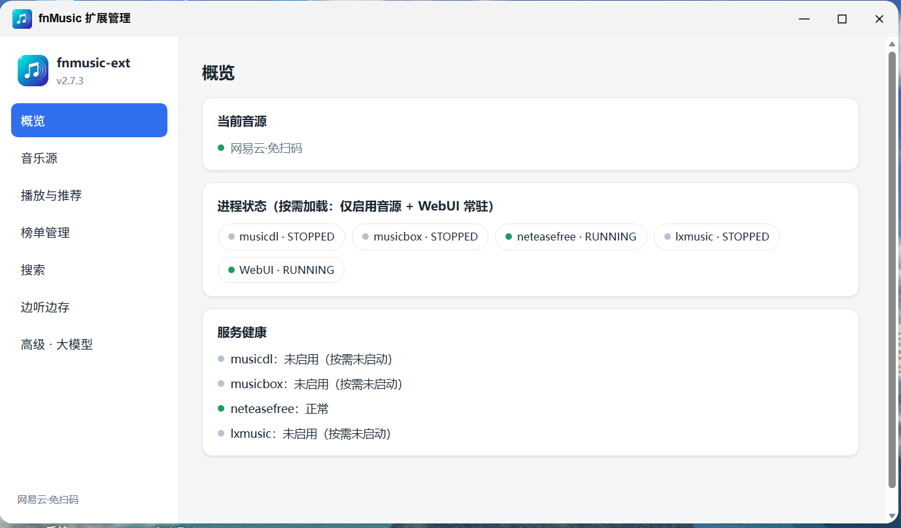

# fnmusic-ext 飞牛音乐扩展（二开）

[](https://github.com/12hgl/fnos_music_ext)
[](LICENSE)
[](VERSION)

> **本项目是 [javycoder/fnos_music_ext](https://github.com/javycoder/fnos_music_ext) 的二开版本。**
> 衷心感谢原作者 [@javycoder](https://github.com/javycoder) 的杰出工作与开源贡献，原始架构与绝大部分功能均出自原作者

---

`fnmusic-ext` 是专为 **fnOS（飞牛私有云）** 自带的音乐应用（`trim.music`）打造的**无侵入增强扩展**。
它通过接管官方后端的 Unix Socket 通信入口，在**完全不修改官方程序、nginx 配置与数据库**的前提下，让原生飞牛音乐获得在线音乐能力；可随时一条命令还原官方直连。



---

## 功能特性

- **在线聚合搜播**：在官方搜索框输入歌名，聚合音源曲库，在线歌曲即点即播，自动补齐滚动歌词与高清封面。搜索结果严格**本地优先**：本地曲库条目始终排在前面，在线音源结果紧随其后；
- **四音源互斥单选**（v2.0.0 起互斥，可在 WebUI 秒级切换）：
  - [musicbox](https://github.com/darknessomi/musicbox)：网易云高品质解析，支持扫码登录 VIP/无损曲库与原生每日推荐；
  - [musicdl](https://github.com/CharlesPikachu/musicdl)：酷我/咪咕等平台聚合，可按平台粒度勾选（编号见 [musicdl-service/PLATFORMS.md](musicdl-service/PLATFORMS.md)）；
  - **neteasefree**：网易云免扫码方案，连接兼容 [NeteaseCloudMusicApi](https://github.com/Binaryify/NeteaseCloudMusicApi) 协议的后端（默认 `https://zm.wwoyun.cn`），**服务端登录态解析 VIP 直链**，支持分类歌单聚合、每日推荐扩容等高级构建链；
  - **lxmusic**：洛雪音乐自定义源运行时——搜索/歌词/榜单走内置平台接口，播放解析由你提供的洛雪自定义源脚本（在容器内执行）完成。源脚本支持三种配置方式：**粘贴 URL**、**上传电脑上的 `.js` 文件**、**从 NAS 选择 `.js`**（飞牛桌面内）；
- **管理 WebUI**（可选，仅本机 8774）：在已登录的飞牛管理员页面打开。浏览器里完成音源切换、musicdl 平台勾选、网易扫码、洛雪源配置、音质偏好、边听边存、推荐开关与 LLM 配置、**榜单管理**，全部热生效；
- **音质偏好**：`高音质`（从高到低）/ `平衡`（取中间档）/ `流畅`（优先最低）三种模式，覆盖全部音源；
- **智能边听边存**：在线听歌时后台自动缓存，再次播放本地秒开；完整试听后自动保存进本地曲库；未下完曲目后台断点续传；
- **自动下载封面**：自动保存到本地曲库的歌曲落库后自动把封面**内嵌进音频文件**（飞牛只认内嵌封面），官方 App 里下载的歌即有封面图；
- **自动下载歌词**（默认关）：自动保存到本地曲库的歌曲在完整下载成功后，自动下载同名 `.lrc` 歌词放到歌曲同一个文件夹；
- **收藏/加歌单自动绑定本地**（默认关）：收藏或加歌单的在线歌曲先立即生效，随后后台自动下载到本地曲库并自动写进飞牛官方的收藏/歌单列表；
- **智能推荐体系**：
  - **每日推荐 MM-DD**：按账户隔离；网易原生每日推荐 + **内置大模型兜底** + **聚合网易热门歌单扩容到 200+ 首**（`FNMUSIC_RECOMMEND_SIZE`，默认 200）；
  - **分类歌单**（二开新增，v2.7.0）：华语 / 流行 / 摇滚 / 民谣 / 电子 / 古风 / 说唱 / 轻音乐 / 爵士 等独立歌单，每个默认 200 首（`FNMUSIC_RECOMMEND_CATEGORIES` / `FNMUSIC_RECOMMEND_CATEGORY_SIZE`，均支持热重载）；
  - **排行榜歌单**（二开新增，v2.7.3）：酷狗 20 个 + 网易云 18 个，共 **38 个**热门榜单，每个默认 100 首（`FNMUSIC_CHART_LIMIT`），总开关 / 来源开关 / 逐榜白名单全部热重载；
- **启动即预热**：容器启动后 5 秒后台自动构建分类歌单、每日推荐；排行榜歌单用**内存 + 磁盘双层缓存**，按天重建，磁盘历史回退，冷启动进列表不空白；
- **内置大模型网关**：默认接入 [Kilo AI Gateway](https://app.kilo.ai/)（OpenAI 兼容），其免费模型支持匿名调用，**免配置开箱即用**；也可一键切换为自定义 OpenAI 兼容接口（DeepSeek / GPT / Qwen 等），接入方与密钥均热重载；
- **网易账号歌单**（默认关）：网易盒子扫码登录后，账号自建歌单以只读歌单出现在音乐页官方歌单上方；
- **官方音质偏好转码**：官方 App 选择"标准"时，在线歌曲由 ffmpeg 实时转码为 AAC HLS 分片流播放（`FNMUSIC_TRANSCODE_ENABLED`，默认开）；
- **推荐构建预算与渐进上架**：单次推荐生成有总秒数预算（`FNMUSIC_RECOMMEND_BUDGET_S`，默认 40s），每解析一首即渐进上架，超时不丢已完成部分；
- **封面智能补全**：musicdl/lx 搜索结果缺封面时，用网易曲库同名曲补全；
- **.env 热重载**：白名单键（音源开关 / 音质 / 推荐 / 歌词 / 封面 / 榜单 / 转码 等）改后约 2 秒自动生效，**无需重启**；
- **多用户隔离收藏**：家庭多成员的红心收藏彼此独立，与本地曲库融合。

---

## 架构

```text
[飞牛音乐客户端 Web / App / 车载]
            │
            ▼
      [飞牛 Nginx]（Unix Socket）
            │
┌─────────────────────────────────────────────────────────────┐
│ fnmusic-ext 代理（宿主机 systemd，零侵入接管 Socket）        │
│   ├─ 本地接口透传 ──► 官方后端 (upstream socket)             │
│   ├─ 在线搜索/播放/歌词/封面/收藏                            │
│   ├─ 边播边存 Tee 落盘                                      │
│   ├─ 榜单双层缓存 + 启动预热                                │
│   ├─ 推荐构建（每日 / 分类 / 热门 / 排行榜）                 │
│   └─ .env 热重载（2s 检测，白名单键免重启生效）              │
└───────────────┬─────────────────────────────────────────────┘
                │ 127.0.0.1（音源仅本机；WebUI 供浏览器）
┌───────────────▼─────────────────────────────────────────────┐
│ Docker 单容器 fnmusic-sources（supervisor 按需加载）          │
│   ├─ musicdl      127.0.0.1:8768  → 容器 8001               │
│   ├─ musicbox     127.0.0.1:8770  → 容器 8002（扫码走 WebUI）│
│   ├─ lxmusic      127.0.0.1:8772  → 容器 8003               │
│   ├─ neteasefree  127.0.0.1:8776  → 容器 8005（二开新增）   │
│   └─ WebUI        127.0.0.1:8774  → 容器 8004（飞牛管理员） │
│   只启动当前所选音源进程（+可选 WebUI），其余不驻留内存；     │
│   切换音源 = supervisorctl 秒级 stop/start                   │
└─────────────────────────────────────────────────────────────┘
```

核心代理必须在宿主机以 systemd 运行（接管 Socket）；音源 + WebUI 合并为一个 Docker 容器，镜像内由 supervisor 按需管理进程，启动时读取挂载的 `.env` 只拉起所选进程——常驻内存约 100-200MB。

---

## 快速开始

### 前置条件

1. fnOS 已在「应用中心」安装并启动官方**飞牛音乐**应用；
2. fnOS 已安装 **Docker**（v2.0.0 起仅支持 Docker 部署音源，未安装 Docker 会直接报错退出）。

### 安装（推荐：应用中心 fpk 包）

从 [GitHub Releases](https://github.com/12hgl/fnos_music_ext/releases) 下载最新 `fnmusic-ext-<版本>.fpk`，在 fnOS「应用中心 → 手动安装」选择该文件，按向导选择**初始音源**即可自动完成安装并启用。

- 桌面会出现「fnMusic 扩展管理」图标，点击即在飞牛桌面窗口内打开管理页（音源切换 / 扫码登录 / 平台选择 / 洛雪源配置 / 榜单管理）；
- 选洛雪音源时向导不索要任何源信息：装好后打开管理页，在「音乐源 → 洛雪自定义源」里粘贴脚本 URL、上传电脑 `.js` 文件或从 NAS 选择，测试可用后保存即激活；
- 选 neteasefree 音源时向导会让你填一个后端 URL（默认 `https://zm.wwoyun.cn`，可留空使用默认）；
- 在应用中心可随时「停止」（秒级还原官方直连）与「启动」（恢复扩展）；
- 卸载前会自动把配置与数据（.env、网易云登录、收藏、播放历史）备份为存储卷根目录的 `fnmusic-ext-backup-<时间戳>.tar.gz`，需要彻底清理时手动删除该文件即可；
- 也可用命令行安装：`sudo appcenter-cli install-fpk fnmusic-ext-<版本>.fpk`。

> 升级：应用中心内直接安装新版本 fpk（升级前自动备份用户数据，升级后恢复）。命令行 `install-fpk` 在已安装时不会升级，请在应用中心操作。

### 安装（进阶：git clone 脚本安装）

适合需要修改代码或精细控制参数的用户：

```bash
sudo apt-get update && sudo apt-get install -y python3 python3-venv git
git clone https://github.com/12hgl/fnos_music_ext.git fnmusic_ext
cd fnmusic_ext
chmod +x install.sh extend.sh restore.sh proxy/run_proxy.sh
./install.sh
```

向导依次引导：**音源四选一**（**默认 3 = neteasefree**，免扫码；1 网易云 musicbox → 扫码登录；2 musicdl → 平台多选；4 洛雪 → 直接安装，源脚本装后在管理页配置）→ **是否安装管理 WebUI**（默认否）→ **大模型兜底推荐**（默认启用内置 Kilo，免配置；也可选自定义接入）→ 自动执行 `./extend.sh` 接管验收。

> 非交互模式（`--non-interactive`）不指定 `--sources` 时，缺省音源同样为 **neteasefree**。

非交互示例：

```bash
# musicbox 网易云 + WebUI
./install.sh --non-interactive --sources musicbox --webui --extend

# musicdl（酷我+咪咕精选）
./install.sh --non-interactive --sources musicdl --extend

# neteasefree 免扫码（默认 zm.wwoyun.cn 后端）
./install.sh --non-interactive --sources neteasefree --extend
# 或指定自己的后端：
./install.sh --non-interactive --sources neteasefree \
  --neteasefree-url 'https://your-api.example.com' --extend

# 洛雪自定义源（可选直接给源：http(s) URL 或本机 .js 文件路径；
# 不给则无源安装，装好在管理页 WebUI 里配置 URL / 上传 .js / NAS 选择）
./install.sh --non-interactive --sources lxmusic \
  --lx-source-url 'https://example.com/your-source.js' --extend
./install.sh --non-interactive --sources lxmusic \
  --lx-source-url "$HOME/scripts/my-source.js" --extend   # 本机路径自动复制进数据卷
./install.sh --non-interactive --sources lxmusic --webui --extend  # 无源安装
```

### 验证

```bash
# 组件健康状态
curl -s --unix-socket /var/run/trim_music.socket http://localhost/_ext/healthz

# WebUI（若安装）：飞牛桌面「fnMusic 扩展管理」，或已登录管理员打开 /app/fnmusic-ext
```

打开飞牛音乐 Web 端或 App，搜索「晴天」等关键词即可试听在线歌曲；底部歌单里可看到每日/热门/分类/排行榜等所有注入的在线歌单。

### 日常运维

```bash
./extend.sh          # 重新启用/自检（改 .env 后重启容器并验收）
./restore.sh         # 秒级还原官方直连（保留 .env 与全部数据）
./restore.sh --full  # 彻底清理（连配置/登录态/缓存/收藏一并删除）
```

网易云扫码（musicbox 源）：终端 `./install.sh --qr`，或登录管理页后在「音乐源」扫码。

---

## 配置参考

配置集中在项目根目录 `.env`（安装向导生成维护，权限 600），完整键项见 [.env.example](.env.example)。改动标注「热重载」的键后约 2 秒自动生效；其余键（路径/端口/容器白名单类）改动后需重跑 `./install.sh` 或 `./extend.sh`。

常用项：

| 配置项 | 默认值 | 说明 |
| :--- | :--- | :--- |
| `FNMUSIC_MUSICDL_ENABLED` / `FNMUSIC_NETEASE_ENABLED` / `FNMUSIC_NETEASEFREE_ENABLED` / `FNMUSIC_LX_ENABLED` | 四选一 | 四音源互斥开关，只能一个为 `true`（非热重载，需重启容器） |
| `FNMUSIC_NETEASE_API_BASE` | 内置默认 | neteasefree 后端 URL（默认 `https://zm.wwoyun.cn`），留空自动使用默认；需为 NeteaseCloudMusicApi 兼容服务 |
| `FNMUSIC_WEBUI_ENABLED` | `true` | 管理 WebUI 开关（仅本机 8774，飞牛管理员打开） |
| `LX_SOURCE_URL` / `LX_SOURCES` | *(空)* / `kg,wy,mg,kw` | 洛雪自定义源脚本地址与启用平台；推荐在 WebUI 里配置 |
| `FNMUSIC_QUALITY_MODE` | `high` | 音质偏好：`high` / `balanced` / `smooth`（热重载） |
| `FNMUSIC_TEE_SAVE_ENABLED` | `true` | 边听边存开关；`FNMUSIC_TEE_SAVE_DIR` 留空自动探测飞牛共享曲库 |
| `FNMUSIC_FAV_AUTO_BIND` | `false` | 收藏/加歌单自动绑定本地（热重载） |
| `FNMUSIC_AUTO_COVER` | `true` | 自动下载封面（热重载） |
| `FNMUSIC_LYRIC_AUTO_DL` | `false` | 自动下载歌词（热重载） |
| `FNMUSIC_TRANSCODE_ENABLED` | `true` | App 标准音质转码播放（热重载） |
| `FNMUSIC_RECOMMEND_DAILY` | `true` | 每日推荐 开关（热重载） |
| `FNMUSIC_RECOMMEND_SIZE` | `200` | 每日推荐目标曲量，不足时聚合热门歌单补齐（20-1000，热重载） |
| `FNMUSIC_RECOMMEND_CATEGORIES` | `华语,流行,摇滚,民谣,电子,古风,说唱,轻音乐,爵士` | 分类歌单分类列表，逗号分隔；置空即关闭 |
| `FNMUSIC_RECOMMEND_CATEGORY_SIZE` | `200` | 每个分类歌单的目标曲量（20-1000，热重载） |
| `FNMUSIC_RECOMMEND_CHARTS` | `true` | **排行榜歌单总开关**（酷狗 20 + 网易云 18 = 38 个榜单，热重载） |
| `FNMUSIC_ENABLED_CHARTS` | *(空)* | 逐榜白名单，逗号分隔榜单 id（如 `kg_8888,wy_19723756`）；留空=全部启用；全关闭哨兵值 `none`（热重载） |
| `FNMUSIC_KG_CHARTS` / `FNMUSIC_WY_CHARTS` | `true` / `true` | 按来源批量开关排行榜（热重载） |
| `FNMUSIC_CHART_LIMIT` | `100` | 单个榜单拉取的曲量上限（热重载） |
| `FNMUSIC_NETEASE_MY_PLAYLISTS` | `false` | 网易账号歌单（热重载） |
| `FNMUSIC_RECOMMEND_BUDGET_S` / `_CANDIDATES` / `_VERIFY_PLAYABLE` | `40` / `36` / `true` | 推荐构建预算秒数 / LLM 候选数 / 逐首可播校验（热重载） |
| `FNMUSIC_COVER_ENRICH` | `true` | 缺失封面用网易曲库补全（热重载） |
| `FNMUSIC_LLM_PROVIDER` | `kilo` | 大模型接入方：`kilo` 内置 Kilo AI Gateway（免配置）/ `custom` 自定义 OpenAI 兼容 / `none` 关闭（热重载） |
| `FNMUSIC_LLM_BASE_URL` / `FNMUSIC_LLM_API_KEY` | *(空)* | 自定义接入的 Base URL 与 Key；留空即用内置 Kilo（免费模型可匿名，无需 Key）（热重载） |
| `FNMUSIC_LLM_MODEL` | `kilo-auto/free` | 模型名；内置默认自动路由到最佳免费模型（热重载） |
| `FNMUSIC_ENV_WATCH` | `true` | `.env` 热重载总开关 |

---

## 常见问题

- **WebUI 打不开**：确认安装时选择了 WebUI，或 `.env` 中 `FNMUSIC_WEBUI_ENABLED=true` 后运行 `./extend.sh`。用飞牛管理员打开桌面「fnMusic 扩展管理」或 `/app/fnmusic-ext`，不要直接访问 8774。
- **洛雪源播放失败**：源脚本由第三方提供，在容器内执行。导入前必须自行确认来源安全，不要导入来历不明的脚本。可在 WebUI 中用「测试」按钮验证源可用性，失败时更换源 URL 或重新上传脚本文件。
- **neteasefree 源歌曲播放失败 / VIP 不生效**：后端需为 NeteaseCloudMusicApi 兼容服务，且服务端登录态有效（自带 cookie）。确认 `FNMUSIC_NETEASE_API_BASE` 指向的后端 URL 能正常响应；默认 `https://zm.wwoyun.cn` 如失效可自行搭建或替换。
- **分类歌单不显示 / 为空**：分类歌单依赖 neteasefree 音源的分类歌单接口（`/api/v1/top/playlist?cat=<分类>`）。如当前启用的是 musicbox 或 musicdl/lxmusic，分类歌单不会显示——这是预期行为，切换到 neteasefree 即可。
- **排行榜歌单（榜单）不显示**：确认 `FNMUSIC_RECOMMEND_CHARTS=true`、`FNMUSIC_KG_CHARTS=true`、`FNMUSIC_WY_CHARTS=true`；管理页「榜单管理」里检查总开关和逐榜勾选。榜单首次构建需要几秒，冷启动时进列表稍等。
- **切源后内存没有变化**：切换在容器内完成，`docker stats fnmusic-sources` 稍等片刻后查看；未启用音源进程会被停止而非休眠。
- **改了 `.env` 不生效**：热重载仅覆盖白名单键（音源开关 / 音质 / 推荐 / 歌词 / 封面 / 榜单 / 转码 等）；音源选择（四个 `*_ENABLED`）、路径、端口、容器白名单类改动需执行 `./extend.sh` 重启容器。
- **每日推荐还是只有几十首**：把 `FNMUSIC_RECOMMEND_SIZE` 调到 200 或更高（默认已是 200），启用 neteasefree 音源以启用聚合链；改大后当日缓存自动重建。

---

## 从 v1.x 升级

v2.0.0 是**架构级重构**：部署形态（三容器 → 单容器）、数据目录（`musicbox-data/` → `sources-data/`）、配置键（`LX_THIRD_PARTY` 移除）均有变化。**推荐先还原再安装**，让升级从干净状态开始（`.env` 与全部数据保留，不会丢配置）：

```bash
cd /path/to/fnmusic_ext
git pull
./restore.sh      # 先还原官方直连并清理旧部署（v2 的 restore 兼容清理 v1.x 旧容器/宿主机服务）
./install.sh      # 全新安装，按向导四选一
```

直接原地升级（`git pull && ./install.sh`）同样支持——安装器会自动迁移数据目录、清理旧三容器。但机器状态复杂时（曾混用 host/Docker 模式、历经多次版本升级），先 `./restore.sh` 再安装更稳妥省心。

另注意：

1. **四音源互斥**：原项目是三音源，本仓库新增 `neteasefree`，旧 `.env` 里未设置 `FNMUSIC_NETEASEFREE_ENABLED` 不会出错（默认为 `false`）；但如果旧 `.env` 里 musicbox 关闭后没显式选新源，会要求重新四选一；
2. **`LX_THIRD_PARTY` 移除**：lxmusic 不再内置第三方聚合解析链，播放解析完全由你的洛雪自定义源脚本提供（安装或 WebUI 中配置）；
3. **平台编号**：`53`（zhuolin）已随上游 musicdl 2.13.11 下线退役，编号永久空缺；新增 `64`（yinyueku）。

---

## 开发与测试

```bash
# 全量测试（无需 Docker/飞牛环境）
python3 -m pytest
```

仓库结构：

```
repo-src/
├── proxy/              核心代理（app.py / charts.py / recommend.py / cache_gc.py / transcode.py / nmplaylists.py / takeover.py ...）
├── musicdl-service/    musicdl 音源服务
├── musicbox-service/   musicbox（网易云盒子）音源服务
├── neteasefree-service/  neteasefree 免扫码音源服务（本仓库新增）
├── lxmusic-service/    洛雪自定义源运行时
├── webui-service/      管理界面（app.py / static/{index.html,app.js,style.css}）
├── container/          单容器镜像构建与 supervisor 编排
├── scripts/            e2e_check.sh / collect_support_info.sh / repair_unknown_library.py
├── install.sh          安装向导脚本
├── extend.sh           接管/重启脚本
├── restore.sh          还原脚本
├── fnmusic-ext.service 宿主机 systemd 服务文件
└── .env.example        完整配置键项示例
```

---

## 免责与版权声明

- 本项目基于 **MIT 许可证** 开源（见 [LICENSE](LICENSE)），严格限定于**个人技术研究与非商业用途**；
- 本项目是协议中继与数据适配层，不托管、不分发任何受版权保护的音频与元数据；音频及元数据版权归属各原始版权方，请支持正版；
- 洛雪自定义源脚本等第三方代码由使用者自行提供并在容器内执行。导入 URL 或 `.js` 前必须自行确认来源安全，不要导入来历不明的脚本，且仅访问您有权收听的内容；
- **neteasefree 后端**（如 `zm.wwoyun.cn`）由第三方维护、可能失效或下架；本项目仅提供适配层，不保证具体后端的可用性与合规性；
- 使用者应遵守所在国家/地区法律法规与第三方平台用户协议；因滥用导致的任何责任由使用者自行承担。

---

## 上游致谢

- 特别感谢原项目作者 [@javycoder](https://github.com/javycoder) —— [javycoder/fnos_music_ext](https://github.com/javycoder/fnos_music_ext)，本仓库为在此基础上进行二次开发；
- 榜单与多分类歌单实现参考了 [zouclang/fnos_music_ext](https://github.com/zouclang/fnos_music_ext) 的公开实现，特此致谢；
- [CharlesPikachu/musicdl](https://github.com/CharlesPikachu/musicdl)、[darknessomi/musicbox](https://github.com/darknessomi/musicbox)、洛雪音乐（LX Music）社区及其自定义源规范、[Binaryify/NeteaseCloudMusicApi](https://github.com/Binaryify/NeteaseCloudMusicApi)。
